# DataMining_Fianl
In the wake of an unprecedented global health crisis, the impact of COVID-19 has been profound, with over one million cases reported in the United States alone (CDC, 2023). The pervasive threat of contracting the virus and its severe consequences underscore the urgent need for a comprehensive understanding of its dynamics. This project aims to delve into the depths of COVID-19 data, employing a meticulous analysis to extract insightful perspectives. The overarching goal is to construct a predictive model that can discern whether a patient is at high risk or not, facilitating enhanced preparedness and patient care. Through this endeavor, the focus will be on identifying the major factors that significantly contribute to placing individuals in the high-risk category, thereby contributing valuable insights to the ongoing battle against the pandemic.

# Prepocessing
**1. Changing DATE_DIE into DIED and a numerical feature**

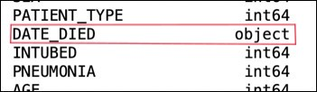
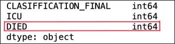

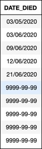 
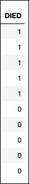

**2. Checking missing values**
- INTUBED
- PREGNANT
- ICU

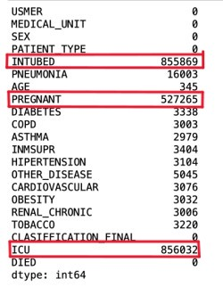

### Preprocessing - INTUBED ###
**The missing values of (97) are all corresponding with (2) Patients who have never been hospitalized couldn't possibly be connected to the ventilator.**

<!-- 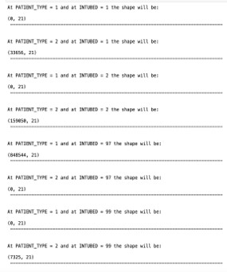 -->
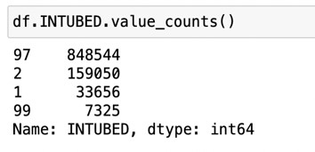 
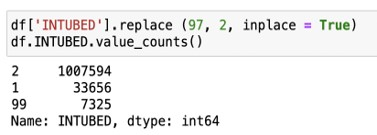

### Preprocessing - PREGNANT ###
**All values of 98 are of the missing values corresponding to the female values. Replace all the corresponding values to the male section (97) with (2); since men can't be pregnant.**

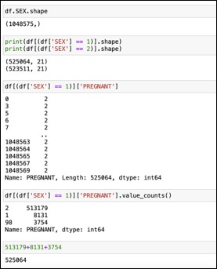
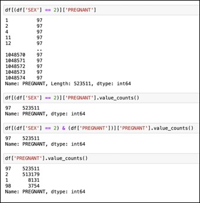
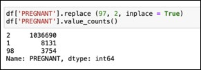

### Preprocessing - ICU ###
**The missing values of (97) are all corresponding to the values of PATIENT_TYPE = 1 Patients who have never been hospitalized couldn't possibly be admitted to the ICU.**

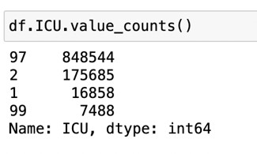

# Data Analysis
**Number of people alive and died from the dataset**
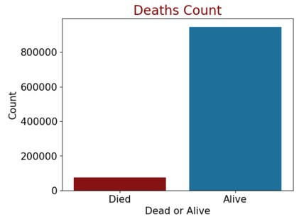
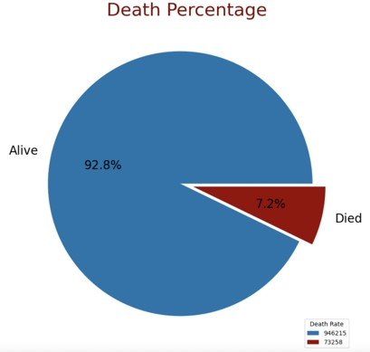

**After that defining new column “Covid_or_Not” from on the CLASSIFICATION_FINAL. Then, calculate the proportion of Covid carrier among the dead. Among dead, 71.1 % of the patient were COVID carriers.** 

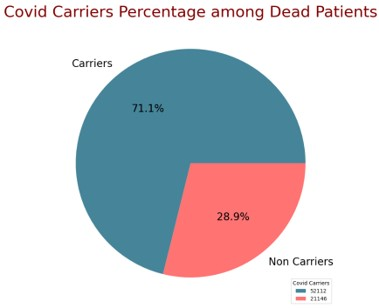

# Feature selection 

**In this section, we use different models (Full Model, Filter Model, and Wrapper Model) to test the accuracy, F1 score, and AUC. After testing, we found that using all features is the best approach.**
| Category  | Full Model | Filter Model | Wrapper Model |　
| :-------- | :--------: | :----------: | :-----------: |
| Accuracy | `0.8996`  | 0.8971 | 0.7750 |
| F1 | `0.8996`| 0.8971 | 0.7750 |
| AUC | `0.9616` | 0.9571 | 0.8546 |

| Category  | Full Model | Filter Model | Wrapper Model |
| :-------- | :--------: | :----------: | :-----------: |
| Accuracy  | 0.8996     | 0.8971       | 0.7750        |
| F1        | 0.8996     | 0.8971       | 0.7750        |
| AUC       | 0.9616     | 0.9571       | 0.8546        |

# Modeling

**After feature selection, we concluded that using the full model would be the best approach. In this section, we use all features and multiple models to test the accuracy, F1 score, and AUC. In conclusion, the `Decision Tree` is the best model according to AUC, while the `Random Forest` is the best model according to accuracy and F1 score.**

| Category  | Logistic Regression | Decision Tree | SVM | Random Forest | Bagging | GradientBoosting |　
| :-------- | :--------: | :----------: | :-----------: | :-----------: | :-----------: | :-----------: |
| Accuracy | 0.8994 | 0.9481 | 0.5006 | `0.9547` | 0.9315 | 0.9183 |
| F1 | 0.8994 | 0.9481 | 0.5006 | `0.9547` | 0.9315 | 0.9183 |
| AUC | 0.9617 | `0.9929` | 0.1632 | 0.9859 | 0.9767 | 0.9684 |

##
**In this case, we also calculated and predicted the features that are more related to the people who contracted COVID-19.**

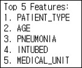

# conclusion

### The best models are: 
- Random Forest: Accuracy of 95.47%
- Decision Tree: AUC of 99.29%

### Top features for prediction:
- Patient Type = Hospitalized
- INTUBED = Connected to the ventilator
- PNEUMONIA = Have air sacs inflammation
- AGE = Old
